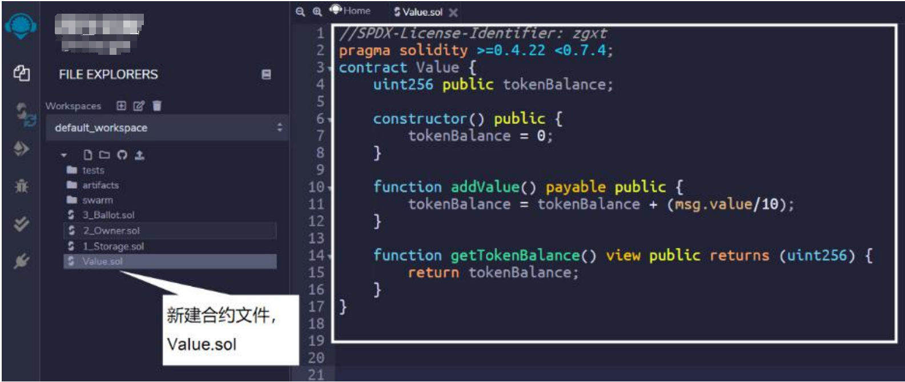
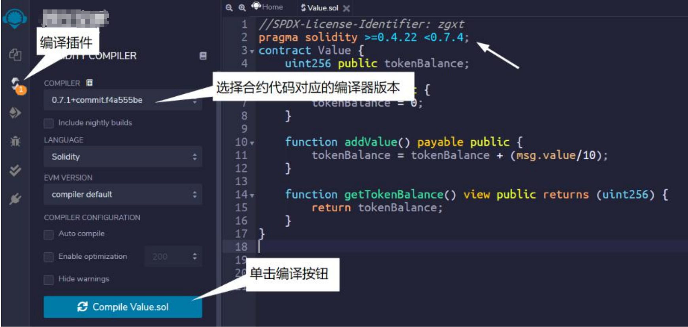

# 值类型

Solidity 是一种静态类型语言，常见的静态类型语言有 C、C++、Java 等，静态类型意味着程序在编译时就确定了每个变量（本地或状态变量）的类型。

Solidity 数据类型看起来很简单，但也容易出现问题，因为 Solidity 的类型非常在意所占空间的大小（因为不同的数据大小，其存储的 gas 成本是不一样的），如果不注意就可能发生“溢出”等问题。

Solidity 数据类型分为两类：

- 值类型（Value Type）
- 引用类型（Reference Type）

**测试实例**

步骤一：在文件管理器根目录下新建合约文件 Value.sol。如图  所示：

步骤二：切换到编译插件面板，选择合约文件对应的编译器版本，单击“Compile Value.sol”按钮，进行编译。如图 所示：

### 1.2.1 值类型

先来介绍值类型，值类型在赋值或传参时，总是进行值拷贝，用值类型声明的变量，总是可以保存在 32 个字节的空间里。

值类型包含有：

- 布尔类型（Booleans）
- 整型（Integers）
- 定长浮点型（Fixed Point Numbers）
- 定长字节数组（Fixed-size byte arrays）
- 有理数和整型常量（Rational and Integer Literals)
- 字符串常量（String literals）
- 十六进制常量（Hexadecimal literals）
- 枚举（Enums）
- 函数类型（Function Types）
- 地址类型（Address)
- 地址常量（Address Literals）
