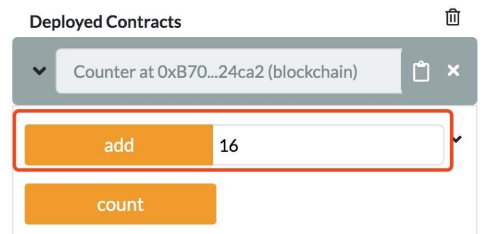
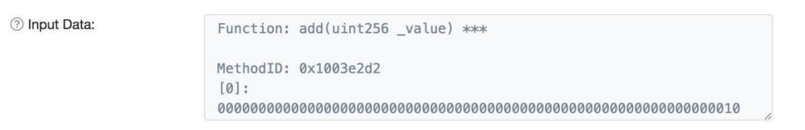
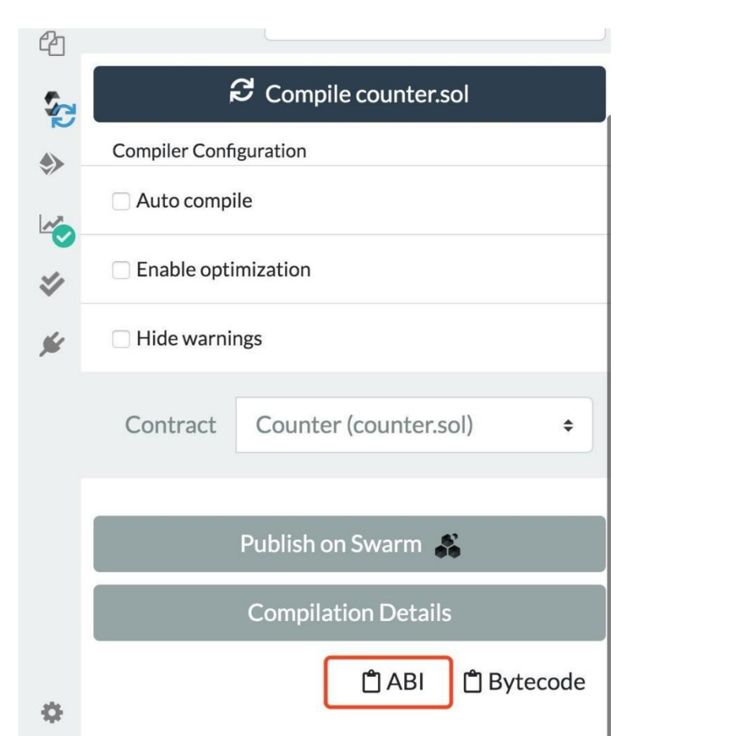

# ABI 接口

在以太坊（Ethereum）生态系统中，应用程序二进制接口（Application Binary Interface，ABI）是从区块链外部与合约进行交互，以及合约与合约之间进行交互的一种标准方式。

### 2.4.1 ABI 编码

之前介绍以太坊交易和比特币交易的不同时提到，以太坊交易多了一个 DATA 字段，DATA 的内容会解析为对函数的消息调用，DATA 的内容其实就是 ABI 编码。

以下面这个简单的合约为例来理解一下。

```solidity
pragma solidity ^0.5.0; 
contract Counter { 
  uint counter; 
  constructor() public { 
    counter = 0; 
  } 
  function count() public { 
    counter = counter + 1; 
  } 
  function get() public view returns (uint) { 
    return counter; 
  } 
}
```

把合约部署到以太坊测试网络 Ropsten 上，并调用 count()，然后查看实际调用附带的输入数据，在区块链浏览器 etherscan 上交易的信息

### 2.4.2 函数选择器

在调用函数时，用前面 4 字节的函数选择器指定要调用的函数，函数选择器是某个函数签名（下面介绍）的 Keccak（SHA-3）哈希的前 4 字节，即： `bytes4(keccak256("count()")) `

count()的 Keccak 的 hash 结果是： `06661abdecfcab6f8e8cf2e41182a05dfd130c76cb32b448d9306aa9791f3899`，开发者可以用一个 在线 hash 的工具([https://emn178.github.io/online-tools/keccak_256.htm](https://emn178.github.io/online-tools/keccak_256.htm))验证下，取出前面 4 个字节就是 0x06661abd。

函数签名是函数名及参数类型的字符串（函数的返回类型并不是这个函数签名的一部分）。比如上文中的 count()就是函数签名，当函数有参数时，使用参数的基本类型，并且不需要变量名，因此函数 add(uint i)的签名是 add(uint256)，如果有多个参数，使用“,”隔开，并且要去掉表达式中的所有空格。因此，foo(uint a, bool b) 函数的签名是 foo(uint256,bool)，函数选择器计算则是：

`bytes4(keccak256("foo(uint256,bool)")) `

公有或外部（public /external）函数都有一个成员属性.selector 来获取函数的函数选择器。

### 2.4.3 参数编码

如果一个函数带有参数，编码的第 5 字节开始是函数的参数。在前面的 Counter 合约里添加一个带参数的方法：

`function add(uint i) public { counter = counter + i; } `

重新部署之后， 使用 16 作为参数调用 add 函数，调用方法如图所示。



在 etherscan 上参看交易附加的输入数据，查询地址为： [https://ropsten.etherscan.io/tx/0x5f2a2c6d94aff3461c1e8251ebc5204619acfef66e53955dd2cb81fc](https://ropsten.etherscan.io/tx/0x5f2a2c6d94aff3461c1e8251ebc5204619acfef66e53955dd2cb81fc) c57e12b6，该截图如图  所示。



输入数据为： 0x1003e2d20000000000000000000000000000000000000000000000000000000000000010。其中，前 4 个字节 0x1003e2d2 为 add 函数的函数选择器，后面的 32 个字节是参数 16 的 16 进制表示，会补充到 32 字节长度。不同的类型，其参数编码方式会有所不同，详细的编码方式可以参考 ABI 编码规范：[https://learnblockchain.cn/docs/solidity/abi-spec.html](https://learnblockchain.cn/docs/solidity/abi-spec.html)。

### 2.4.4 通过 ABI 编码调用函数

通常，在合约中调用 Counter 合约的 count() 函数的形式是：Counter.count() ，在上一章，介绍过底层调用 call 函数，因此也可以直接通过 call 函数和 ABI 编码来调用 count()函数：

```solidity
(bool success, bytes memory returnData) = address(c).call("0x06661abd"); // c 为 Counter 合约地址，0x06661abd
require(success);
```

其中，c 为 Counter 合约地址，0x06661abd 是 count()函数的编码，如果 count()函数发生异常，call 调用会返回 fasle，因此需要检查返回值。

使用底层调用有一个好处：可以非常灵活的不同合约的不同的函数，并且在编写合约时，并不需要提前知道目标函数的合约地址及函数，例如，可以定义一个 Task 合约，它可以调用任意合约：

```solidity
contract Task { 
  function execute(address target, uint value, bytes memory data)
    public payable returns (bytes memory) { 
    (bool success, bytes memory returnData) = target.call{value:value}(data); 
    require(success, "execute: Transaction execution reverted."); 
    return returnData;   
  } 
}
```

### 2.4.5 ABI 接口描述

ABI 接口描述是由编译器编译代码之后，生成的一个对合约所有接口和事件描述的 JSON 文件。

一个描述函数的 JSON 包含以下字段。

- type：可取值有 function、constructor、fallback，默认为 function。
- name：函数名称。
- inputs：一系列对象，每个对象包含以下属性。

  name：参数名称。

  type：参数的规范类型。

  components：给元组类型使用，当 type 是元组（tuple）时，components 列出元组中每个元素的名称（name）和类型（type）
- outputs：一系列类似 inputs 的对象，无返回值时，可以省略。
- payable：true 表示函数可以接收以太币，否则表示不能接收， 默认值为 false。
- stateMutability： 函数的可变性状态，可取值有：pure、view、nonpayable、payable。
- constant：如果函数被指定为 pure 或 view，则为 true。

一个事件描述的 JSON 包含以下字段。

- type：总是 “event”。
- name：事件名称。
- inputs：对象数组，每个数组对象会包含以下属性。

  name：参数名称。

  type：参数的权威类型。

  components：供元组(tuple)类型使用。
- indexed：如果此字段是日志的一个主题，则为 true，否则为 false。
- anonymous：如果事件被声明为 anonymous，则为 true。

在 Remix 的编译器页面，编译输出的 ABI 接口描述文件，查看一下 Counter 合约的接口描述，只需要在如图 所示红框处单击“ABI”，ABI 描述就会复制到剪切板上。



下面是 ABI 描述代码示例。

```json
[
{ "constant": false, "inputs": [], "name": "count", "outputs": [], "payable": false, "stateMutability": "nonpayable", "type": "function" }, { "constant": true, "inputs": [], "name": "get", "outputs": [ { "internalType": "uint256", "name": "", "type": "uint256" } ], "payable": false, "stateMutability": "view", "type": "function" }, { "inputs": [], "payable": false, "stateMutability": "nonpayable", "type": "constructor" }
]
```

JSON 数组中包含了 3 个函数描述，描述合约所有接口方法，在合约外部（如 DAPP）调用合约方法时，就需要利用这个描述来获得合约的方法，后面会进一步介绍 ABI JSON 的应用。 不过，DApp 开发人员并不需要使用 ABI 编码调用函数，只需要提供 ABI 的接口描述 JSON 文件，编码由 Web3 或 ether.js 库来完成。
