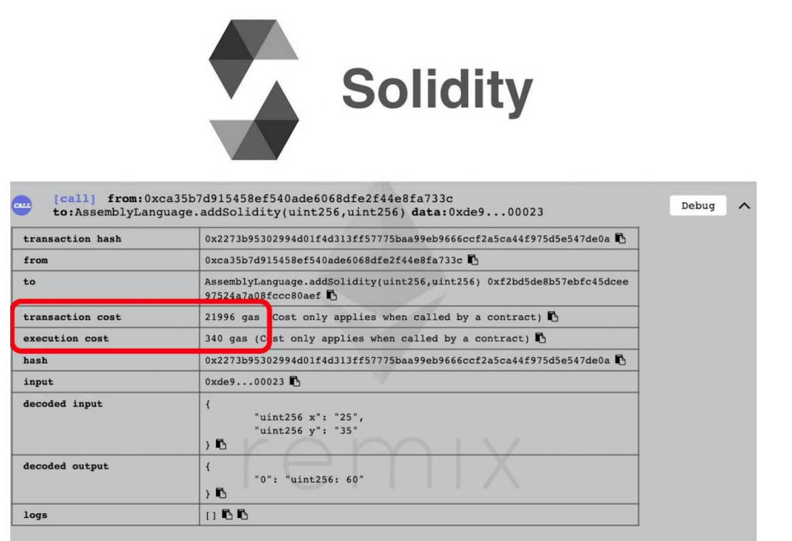
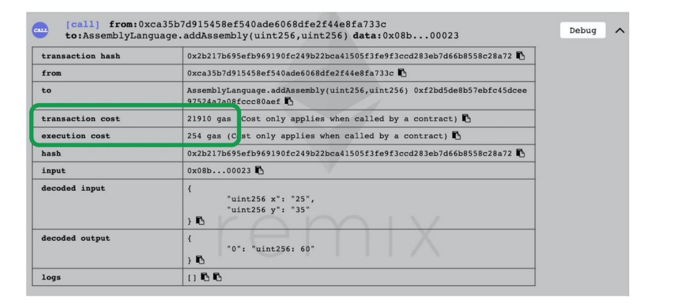

# 使用内联汇编

### 2.6.1 汇编基础概念

实际上很多高级语言（例如 C、Go 或 Java）编写的程序，在执行之前都将先编译为“汇编语言”。汇编语言与 CPU 或虚拟机绑定实现指令集，通过指令来告诉 CPU 或虚拟机执行一些基本任务。

Solidity 语言可以理解为是以太坊虚拟机 EVM 指令集的抽象，让操作者编写智能合约更容易。而汇编语言则是 Solidity 语言和 EVM 指令集的一个中间形态，Solidity 也支持直接使用内联汇编，下面是在 Solidity 代码中使用汇编代码的例子。

```solidity
contract Assembler { 
function do_something_cpu() public { 
assembly { 
// 编写汇编代码 
} 
} 
}
```

在 Solidity 中使用汇编代码有这样一些好处。

- 进行细粒度控制 可以在汇编代码使用汇编操作码直接与 EVM 进行交互，从而对智能合约执行的操作进行更精细的控制。汇编提供了更多的控制权来执行某些仅靠 Solidity 不可能实现的逻辑，例如控制指向特定的内存插槽。在编写库代码时，细粒度控制特别有用

例如这两个库的实现：String Utils (链接： [https://github.com/Arachnid/solidity-stringutils/blob/master/src/strings.sol](https://github.com/Arachnid/solidity-stringutils/blob/master/src/strings.sol))

和 Bytes Utils (链接：[https://github.com/GNSPS/solidity-bytes-utils/blob/master/contracts/BytesLib.sol](https://github.com/GNSPS/solidity-bytes-utils/blob/master/contracts/BytesLib.sol)）。

- 更少的 Gas 消耗 此处通过一个简单的加法运算对比两个版本的 Gas 消耗，一个版本是仅使用 Solidity 代码，一个版本是仅使用内联 Assembly。

```solidity
function addAssembly(uint x, uint y) public pure returns (uint){
assembly { 
let result := add(x, y) // x+y 
mstore(0x0, result) // 在内存中保存结果 
return(0x0, 32) // 从内存中返回 32 字节 
} 
} 
function addSolidity(uint x, uint y) public pure returns (uint){return x + y; 
}
```

Gas 的消耗，如图所示。





从上图可以看到，使用内联汇编可以节省 86 的 gas。对于这个简单的加法操作来说，减少的 gas 并不多，但可以帮助人们明白直接使用内联汇编将消耗更少的 gas，更复杂的逻辑能更显著地节省 gas。

### 2.6.2 Solidity 中引入汇编

前面已经有个实例，可以在 Solidity 中使用 assembly{}来嵌入汇编代码段，这被称为内联汇编。

```solidity
assembly { 
// some assembly code here 
}
```

在 assembly 块内的代码开发语言被称为 Yul。

Solidity 可以引入多个汇编代码块，不过汇编代码块之间不能通信，也就是说在一个汇编代码块里定义的变量，在另一个汇编代码块中不可以访问。

因此这段代码的 b 无法获取到 a 的值：

```solidity
assembly { let a := 2 } 
assembly { let b := a // Error 
}
```

再来一个使用内联汇编代码完成加法的例子，重写 addSolidity()函数：

```solidity
function addSolidity(uint x, uint y) public pure returns (uint){
assembly { 
let result := add(x, y) // ① x + y 
mstore(0x0, result) // ② 将结果存入内存 
return(0x0, 32) // ③ 
} 
}
```

对上面这段代码作一个简单的说明：① 创建一个新的变量 result，通过 add 操作码计算 x+y，并将计算结果赋值给变量 result；② 使用 mstore 操作码将 result 变量的值存入地址 0x0 的内存位置；③ 表示从内存地址 0x 返回 32 字节。

### 2.6.3 汇编变量定义与赋值

在 Yul 语言中，使用 let 关键字定义变量。使用:=操作符给变量赋值。

```
assembly { 
let x := 2 
}
```

Solidity 只需要用=，因此不要忘了 “:” 。如果没有使用给变量赋值，那么变量会被初始化为 0 值。

```solidity
assembly { 
let x // 自动初始化为 x = 0 
x := 5 // x 现在的值是 5 
}
```

也可以表达式给变量赋值，例如：

```solidity
assembly { let a := add(x, 3) }
```

### 2.6.4 汇编中的块和作用域

在 Yul 汇编语言中，用一对大括号来表示一个代码块，变量的作用域是当前的代码块，即变量在当前的代码块中有效。

```
assembly { 
let x := 3 // 变量 x 一直可见 
{ 
let y := x // 正确 
} // 到此处会销毁 y 
{ 
let z := y // 错误 
} 
}
```

在上面的示例代码中，y 和 z 都是仅在所在块内有效，因此 z 获取不到 y 的值。不过在函数和循环中，作用域规则有一些不一样，将在接下来的循环及函数部分会介绍。

### 2.6.5 汇编中访问变量

在汇编中，只需要使用变量名就可以访问局部变量（指在函数内部定义的变量），无论该变量是定义在汇编块中，还是在 Solidity 代码中，示例代码如下。

```solidity
function localvar() public pure { 
uint b = 5; 
assembly { 
let x := add(2, 3) 
let y := mul(x, b) // 使用了外面的 b 
let z := add(x, y) // 访问了内部定义的 x,y 
} 
}
```

### 2.6.6 for 循环

Yul 同样支持 for 循环，这段示例代码表示对 value+2 计算 n 次：

```
function forloop(uint n, uint value) public pure returns (uint){
assembly { 
for { let i := 0 } lt(i, n) { i := add(i, 1) } { 
value := add(2, value) 
} 
mstore(0x0, value) 
return(0x0, 32) 
} 
}
```

for 循环的条件部分包含 3 个元素：

- 初始化条件：let i := 0。
- 判断条件：lt(i, n) ，这是函数式风格，表示 i 小于 n。
- 迭代后续步骤：add(i, 1)。 可以看出，for 循环中变量的作用范围和前面介绍的作用域略有不同。在初始化部分定义的变量在循环条件的其他部分都有效。

### 2.6.7 if 判断语句

汇编支持使用 if 语句来设置代码执行的条件，但是没有 else 分支，同时每个条件对应的执行代码都需要用大括号包起来。 assembly { if slt(x, 0) { x := sub(0, x) } // 正确 if eq(value, 0) revert(0, 0) // 错误, 需要大括号}

```
assembly { 
if slt(x, 0) { x := sub(0, x) } // 正确 
if eq(value, 0) revert(0, 0) // 错误, 需要大括号
}
```

### 2.6.8 汇编 Switch 语句

EVM 汇编中也有 switch 语句，它将一个表达式的值与多个常量进行对比，并选择相应的代码分支来执行。switch 语句支持一个默认分支 default，当表达式的值不匹配任何其他分支条件时，将执行默认分支的代码。

```
assembly { 
let x := 0 
switch calldataload(4) 
case 0 { 
x := calldataload(0x24) 
} 
default { 
x := calldataload(0x44) 
} 
sstore(0, div(x, 2)) 
}
```

switch 语句的分支条件需要具有相同的类型、不同的值，同时分支条件已经涵盖所有可能的值，那么不允许再出现 default 条件。

要注意的是，Solidity 语言中是没有 switch 语句的。

### 2.6.9 汇编函数

可以在内联汇编中定义自定义底层函数，调用这些自定义的函数和使用内置的操作码一样。下面的汇编函数用来分配指定长度（length）的内存，并返回内存指针 pos：

```
assembly { 
function alloc(length) -> pos { // ① 
pos := mload(0x40) mstore(0x40, add(pos, length)) 
} let free_memory_pointer := alloc(64) // ② 
}
```

上面的代码：① 定义了一个 alloc 函数，函数使用-> 指定返回值变量，不需要显式 return 返回语句；② 则使用了定义的函数。

定义函数不需要指定汇编函数的可见性，因为它们仅在定义所在的汇编代码块内有效。

### 2.6.10 元组

汇编函数可以返回多个值，它们被称为一个元组（tuple），可以通过元组一次给多个变量赋值，如：

```
assembly { function f() -> a, b {} 
let c, d := f() 
}
```

### 2.6.11 汇编缺点

上面的内容介绍了汇编语言的一些基本语法，可以帮助操作者在智能合约中实现简单的内联汇编代码。不过，一定要谨记，内联汇编是一种以较低级别访问以太坊虚拟机的方法。它会绕过例如 Solidity 编译器的安全检查。只有在操作者对自身能力非常有信心且必需时才使用它。
