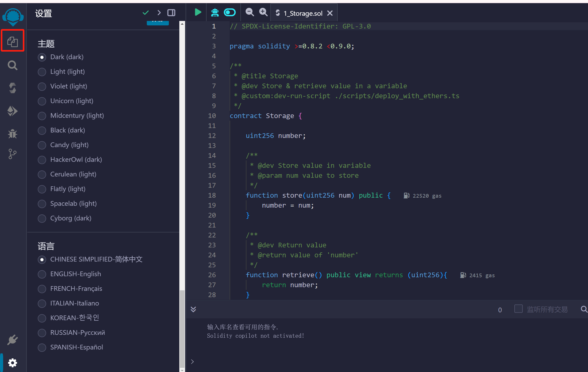
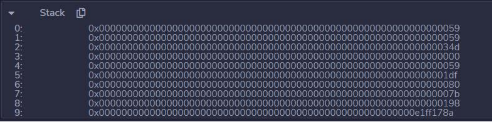

# 智能合约的开发、测试与部署

本章节将从智能合约的起源开始。前面的区块链基础知识讨论了加密、散列和点对点网络等这些成熟算法和技术是如何被创造性地应用到区块链这个去中心化的、可信的、分布式的、不可更改的账本的创新中的。

智能合约的概念早在比特币问世之前就已经存在。计算机科学家尼克·萨博详细介绍了他的加密货币比特黄金（BitcoinGold）的概念。1994 年他写成了《智能合约》(Smart contracts) 论文，是智能合约的开山之作。实际上，Szabo 在 20 多年前就创造了“智能合约”一词。智能合约是以太坊区块链的核心和主要推动力。智能合约的设计和编码不当会导致重大故障，例如 DAO Hack 和 Parity 钱包锁定事件。通过本章的学习，帮助操作者设计，编码，部署和执行智能合约。

智能合约的许多变体在区块链环境中十分普遍。Linux Foundation 的 Hyperledger 区块链具有称为 Chaincode 的智能合约功能。由于以太坊是通用的主流区块链，因此本书选择讨论智能合约的以太坊实现。

## 4.1 什么是智能合约

智能合约是按照用户的需求编写的代码，并部署和运行在以太坊虚拟机上。智能合约是数字化的，它在代码中固化了账户之间交易的规则。智能合约有利于通过原子化交易来实现数字资产的转移，也可以用于存储重要数据，这些数据可以用来记录信息、事件、关系、余额、以及现实世界中的合同中需要约定的信息。智能合约类似于面向对象的 class 类，因此，一个合约可以调用另外一个合约，就像操作者可以在类对象之间进行互相调用和实例化。也可以这样认为，智能合约就是由函数构成的小程序。操作者可以新建一个合约，借助合约里面的函数去查看区块链上的数据，以及按照一些规则去更新数据。

以太坊的一个重要贡献是智能合约层，该合约层支持在区块链上执行任意代码。智能合约增强了以太坊区块链成为强大的去中心化计算系统的能力。

## 4.2 Remix

编写智能合约的工具有很多种，如：Visual Studio。其中，最简单、快速的开发方法是使用基于浏览器的开发工具，如 Remix。打开 [http://remix.ethereum.org](http://remix.ethereum.org) 网页就可以直接使用。Remix IDE（Integrated Development Environment）是一个开放源代码的 Web 和桌面应用程序。它促进了快速的开发周期，并具有丰富的带有直观图形用户界面(Graphical User Interface, GUI)的插件集。Remix 可以在浏览器上进行智能合约的创建、开发、部署和调试。合约维护有关的操作（如：创建、发布、调试）都可以在同一个环境下完成，而不需要切换到其他的窗口或页面。Remix 除了有在线版本，也可以在 github 下载软件包，经过编译，在本地使用。 本章使用 Remix 开发环境进行构建、测试智能合约，并使用 Remix 部署智能合约，通过简单的 Web 界面调用合约。在学习中，操作者必须在测试环境中尝试与智能合约相关的各种概念，以便理解和应用这些概念。

### 4.2.1 基础模块

通过浏览器访问地址 [http://remix.ethereum.org](http://remix.ethereum.org)，可以打开 Remix 的主页面，如图所示。


- 插件面板：单击相应的图标以更改拿个插件显示在侧面板中。
- 侧面板-大多数（但不是全部）插件将在此处具有其 GUI。
- 主面板-用于编辑文件。在选项卡中可以是用于 IDE 编译的插件或文件。
- 终端-您将在其中查看与 GUI 交互的结果。您也可以在此处运行脚本。

以下为主页面入口：

主页位于主面板的选项卡中。也可以通过单击插件面板顶部的徽标来访问主页面，如图所示。


Remix 提供了多种主题选择，可以通过插件面板下方的 来选择自己的深色主题或灰色主题，如图所示。


文件浏览器： 要进入“文件资源管理器”（FILE EXPLORERS）模块，请单击图标，如图所示。



默认情况下，Remix 仅将文件存储在浏览器的本地存储（Local Storage）中。在文件浏览器的“browser”文件夹中包含了一个示例项目。如果打开 Remix IDE 没有看到项目示例（如上图所示），则可以尝试进行清除浏览器缓存的操作，它们就会出现。

**重要说明：清除浏览器存储将永久删除存储在其中的所有 Solidity 文件。**

建立新文件： 单击新建文件图标 ，在弹出的“create new file”对话框中输入文件名后，新的文件将在编辑器中打开，如图所示。


终端： 在终端窗口中，显示了与 Remix 交互时进行的重要操作信息。它集成了 JavaScript 和 Web3 对象。允许执行与当前上下文交互的 JavaScript 脚本。操作者可以搜索或清除终端中的日志，如图所示。


### 4.2.2 典型模块

1. **编译器 **

单击图标面板 ，会切换到 SOLIDITY COMPILER，如图所示。单击编译按钮（图中的 D）会触发编译。如果希望每次修改文件保存后都对文件进行编译，请选中“Autocompile”(图中的 E)。 从 Solidity 0.5.7 版本开始，remix 可以编译 Yul 文件。操作者可以使用“LANGUAG”下拉菜单（图中的 B）来切换语言。 Remix 允许在选择不同的以太坊分叉进行编译。可以在“EVM VERSION”下拉菜单（图中的 C）选择一个特定的 以太坊硬分叉.默认的版本是 compiler default。由于一个合约文件代码中，可以包含多个合约，并且合约文件还可以导入其他的合约文件，因此通常需要编译多个合约。但是，一次只能对一个合约的编译详细信息进行检索（图中的 F）。单击 Compilation Details 按钮（图中的 G）时，将在弹出的窗口中显示当前合约的详细信息。如 BYTECODE、ABI 以及 WEB3DEPLOY 等信息，如图所示。


编译后主要有两种产物：

- ABI（Application Binary Interface）规范
- 合约字节码

ABI 是一个接口，由带有参数的外部函数和公共函数组成。合约和其他使用者如果准备调用合约里面的函数，就可以使用 ABI 来实现。

字节码是合约的体现形式，它运行在以太坊上面。在发布时，字节码是必须的，ABI 只有在调用合约里面的函数时才会用到。操作者可以使用 ABI 创建一个新的合约实例。

合约的发布本身就是一个交易。因此，为了发布合约，操作者需要新建一个交易。在发布时，需要提供字节码和 ABI。由于交易在运行时需要消耗 gas，这些 gas 就需要由合约来提供。一旦交易被打包写入到区块链上后，操作者就可以通过合约地址来使用合约了，调用方也可以通过新地址来调用合约里面的函数。

**编译错误和警告： **

在边栏的最下方会显示编译“错误”和“警告”，如图所示。即使编译器没有显示错误信息，解决已报告的警告问题也是很重要的。


编译成功后，Remix 会为每个编译好的合同创建两个 JSON 文件。其中一个文件包含了 Solidity 编译的输出。这个文件将被命名为 contractName_metadata.json。

另一个 JSON 文件名为 contractName.json 。contractName.json 文件包含了编译的工件。它包含了字节码（bytecode）、部署的字节码（deployedBytecode）、gas 预估（gasEstimates）、方法标识符（methodIdentifiers）和 ABI，如图所示。


1. **部署和运行**

单击图标，会切换到部署和运行交易（DEPLOY & RUN TRANSACTIONS）模块，如图所示。该模块允许把交易发送到当前的环境（ENVIRONMENT）。要使用此模块，需要先编译合约。因此如果在 CONTRACT 选择框（图中 E）中有合约的名称，则可以使用。如果选择框中没有内容，则需要在 中先选择一个合约文件，使其处于激活状态，然后转到编译模块 进行编译，再切换到 “部署和运行”。


环境（图中 A）：

- JavaScript VM：所有交易将在浏览器的沙盒区块链中执行。这意味着当您重新加载 页面时，任何内容都不会保留。JsVM 是其自己的区块链，每次重新加载时，它将启动一个新的区块链，旧的区块链将不被保存。
- Injected Provider：Remix 将连接到注入的 Web3 提供程序。Metamask 是注入 Web3 的提供程序的示例。
- Web3 Provider：Remix 将连接到远程节点。需要将 URL 提供给选定的提供程序：geth，parity 或任何以太坊客户端。

账户（图中 B）： 与当前环境关联的帐户列表（及其关联的余额）。在 JsVM 上，您可以选择 5 个帐户，每个账户的初始余额是 100 ether。如果将注入的 Web3 与 MetaMask 一起使用，则需要在 MetaMask 中更改帐户。

气体限制（图中 C）： 设置了在 Remix 中提交的所有交易所允许的最大气体量。

value(图中 D)： 设置发送到合约或 payable 功能的 ETH，WEI，GWEI 等的数量。（注：payable 功能的按钮将显示为红的）。每次执行交易后，Value 值始终重置为 0）。

部署合约实例（图中 F）： 在合约的选择框（图中 E）指定了合约文件后，单击“Deploy”按钮，将部署所选的合约（这可能需要几秒钟）。需要注意的是，如果合约的构造函数（constructor）是具有参数的，则需要在部署时指定它们。

“At Address”是用于访问已经部署的合约，它假定操作者给定的地址是当前合约的一个实例。Remix 不会对提供的地址是不是该合约的实例进行检查，因此使用此功能要小心，并确保操作者信任该地址的合同。

已经部署的合约： 在“Deployed Contracts”标签下，显示了已经部署的合约列表，展开列表，可以看到自动生成的 UI（也成为 udapp），通过 UI 可以进行交互操作，如图所示。


单击 列表左边的“>”符号，可以看到合约的函数（function）按钮。这些按钮会根据功能的不同显示不同的颜色，如图所示。


**函数参数： **

如果函数需要参数，那么必须在输入框中输入所有的参数。输入框中的提示信息会告诉操作者每个参数的数据类型，当参数的数据类型是数字和地址时，不需要用双引号引起来，但是字符串类型的参数需要使用双引号。多个参数之间用逗号进行分割。

**数组或结构作为参数： **

要将数组或结构（struct）作为参数传递，需要将其放入[ ]中。并且需要在该 Solidity 文件的顶部，添加语句：pragma experimental ABIEncoderV2;下面是一个合约的示例

```solidity
pragma solidity >=0.5.0 <0.7.4; 
pragma experimental ABIEncoderV2; 
contract Sunshine { 
struct Garden { 
uint slugCount; 
uint wormCount; 
Flower[] theFlowers; 
} 
struct Flower { 
uint flowerNum; 
string color; 
} 
Flower public _flower; 
function picker(Garden memory gardenPlot) public { 
_flower = gardenPlot.theFlowers[0]; 
uint a = gardenPlot.slugCount; 
uint b = gardenPlot.wormCount; 
Flower[] memory cFlowers = gardenPlot.theFlowers; 
uint d = gardenPlot.theFlowers[0].flowerNum; 
string memory e = gardenPlot.theFlowers[0].color; 
} 
function getFlower() public view returns ( Flower memory){return _flower; } }
```

编译，部署合约并打开部署实例后，可以将 [1,2,[[3,"Petunia"]]] 作为参数进行传递。函数 picker 接受一个 Garden 类型的结构体。该结构用方括号包裹，参数内又嵌套了一个数据类型为 Flower 结构的数组[3,"Petunia"]，

1. **调试器**

Remix 调试器通过帮助操作者观察合约执行时的运行时行为来定位问题。它工作在 Solidity 及其生成的合约字节码中。可以暂停合约执行以检查合约代码、状态变量、局部变量和堆栈变量，并查看从合约代码生成的 EVM 指令。 调试器在单步执行交易时会显示合约的状态。在 Remix 中提交交易以后，或者通过制定之前的交易地址来使用调试功能。要启动调试会话，需要执行以下操作之一： 无论成功与否，当提交的交易出现在终端窗口时，可以单击“调试”按钮。调试器将在面板中被激活，如图所示。


在插件管理器中单击 ，在交易哈希输入框中，输入已经部署的交易地址，然后单击“启动调试”按钮(Start debugging)，如图所示。


调试器将在编辑器中突出显示相关的合约代码。如果要停止调试，请单击“停止调试”按钮（Stop debugging）。

- **调试器的导航**

在调试面板的的顶部是调试器的导航功能，如图所示。


- 滑块（slider）

拖动滑块时，会同步在代码编辑器中突出显示相关的合约代码。同时交易的操作码也会同步滚动。每个操作码，交易的状态也会同步发生变化，这些变化会反映在调试器的面板中，如图所示。


后退一步（Step over back）

单击按钮将转到上一个操作码。如果上一步是调用其他函数，则不会进入到被调用的函数内。

后退（step back）

单击按钮，返回到上一个操作码。 进入函数（Step into） 单击 按钮，将定位到下一个操作码。如果该操作是调用一个函数，则会进入该函数。

跳出函数（step over forward）

单击按钮，也将定位到下一个操作码。如果该操作是调用一个函数，则不会进入该函数。但是被调用函数会被执行。

调试的一个重要方面是在感兴趣的代码行停止执行，断点有助于做到这点，在编辑器中单击行号，可以设置断点，如图所示。再次单击将删除断点。这样在执行函数期间，当到达此行是，执行会被暂停。


如果将断点设置在声明变量的行中，则可能会触发两次：一次将变量初始化为零，第二次分配实际值。

跳到上一个断点（Jump to prev breakpoint）

单击按钮，滑块会移动至当前位置最近的上一个断点设置处。如上图，假如当前调试的操作码在 23 行，则单击 后，将定位到 20 行。

跳出（jump out）

在函数调用过程中，单击按钮，将结束此次调用。

跳到下一个断点（Jump to next breakpoint）

单击按钮，滑块会移动至当前位置最近的下一个断点设置处。

- **调试器的面板**

**函数堆栈（Function Stack） **

函数栈列出了交易正在与之交互的函数，如图所示。


**本地变量（Solidity State）**

此面板列出函数的局部变量，如图所示。


**状态变量（Solidity State） **

此面板显示合约的状态变量。以太坊拥有一个保存代码和数据的存储器，使用区块链来跟踪这个存储器随着时间的变化。就像通用目的存储程序计算机一样，以太坊可以把代码加载进状态机，然后运行这些代码，并把状态转换的结果保存在区块链上，如图所示。


**操作码 **

此面板显示步骤序号和调试器当前的操作码，如图所示。


操作码可以分为以下一些类别：

- 算术操作：

ADD 对栈顶的两个条目进行加法

MUL 对栈顶的两个条目进行乘法

SUB 对栈顶的两个条目进行减法

DIV 整数除法

SDIV 带符号的整数除法

MOD 模运算

SMOD 带符号的模运算

ADDMOD 先做加法然后进行模运算

MULMOD 先做乘法然后进行模运算

EXP 乘方运算

SIGNEXTEND 符号扩展操作

SHA3 对内存中的一段数据进行 Keccak-256 哈希运算

- 栈操作：

POP 移除栈顶的一个条目

MLOAD 从内存中加载一个“字”

MSTORE 向内存中保存一个“字”

MSTORE8 向内存中保存一个字节

SLOAD 从存储中加载一个“字”

SSTORE 向存储中保存一个“字”

MSIZE 获得当前已分配内存的字节数大小

PUSHx 将 x 字节的一个条目放到栈顶，其中 x 的数值可以是 1 到 32（一个整“字”）的整数

DUPx 复制栈顶的第 x 个条目到栈顶，其中 x 的数值可以是 1 到 16 的整数

SWAPx 交换栈顶条目和第 x+1 个栈内条目，其中 x 的数值可以是 1 到 16 的整数

- 处理流程操作：

STOP 停止执行

JUMP 将程序计数器设置为任意数值

JUMPI 基于条件修改程序计数器的值

PC 取得程序计数器的数值（增加这个指令本身的计数之前的数值）

JUMPDEST 标记一个有效的跳转地址

- 系统操作：

LOGx 增加一条带有 x 个主题的日志数据，其中 x 的数值可以是 0 到 4 的整数

CREATE 用关联代码创建一个新账户

CALL 向另一个账户发起消息调用，也就是运行另一个账户的代码

CALLCODE 用另一个账户的代码向当前账户发起消息调用

RETURN 停止执行并返回输出数据

DELEGATECALL 用其他账户的代码向当前账户发起消息调用，但 sender 和 value 的数值保持不变

STATICCALL 向一个账户发起静态消息调用

REVERT 停止执行并撤销状态修改，但保持返回数据和剩余 gas

INVALID 预设的无效指令

SELFDESTRUCT 停止执行，并将当前账户标记为自毁账户

- 逻辑操作：

LT 小于比较操作

GT 大于比较操作

SLT 有符号小于比较操作

SGT 有符号大于比较操作

EQ 等于比较操作

ISZERO 简单的非操作

AND 按位与操作

OR 按位或操作

XOR 按位异或操作

NOT 按位非操作

BYTE 从一个“字”中取得一个字节数据

- 环境操作：

GAS 取得可用 gas 的数量（减去这个指令的消耗）

ADDRESS 取得当前账户的地址

BALANCE 取得指定账户的余额

ORIGIN 取得触发这次 EVM 执行的 EOA 地址

CALLER 取得当前执行的调用者地址

CALLVALUE 取得当前执行的调用者所发送的以太币数量

CALLDATALOAD 取得当前执行的输入数据

CALLDATASIZE 取得当前输入数据的字节大小

CALLDATACOPY 将当前输入数据复制到内存中

CODESIZE 当前环境运行的代码的字节大小

CODECOPY 将当前环境运行的代码复制到内存中

GASPRICE 取得由初始交易所制定的 gas 价格

EXTCODESIZE 取得任意账户代码的字节大小

EXTCODECOPY 将任意账户的代码复制到内存中

RETURNDATASIZE 取得在当前环境中的前一次调用的输出数据字节大小 RETURNDATACOPY 将前一次调用的输出数据复制到内存中

- **区块操作： **

BLOCKHASH 取得最新的 256 个完整区块中某个区块的哈希

COINBASE 取得当前区块的区块奖励受益人地址

TIMESTAMP 取得当前区块的时间戳

NUMBER 取得当前区块的区块号

DIFFICULTY 取得当前区块的难度

GASLIMIT 取得当前区块的 gas 上限

**堆栈（stack） **

此面板显示 EVM 堆栈，如图所示。



EVM 有一个基于堆栈的架构，在一个栈中保存了所有内存数值。EVM 的数据处理单位被定义为 256 位的“字”，并且它还具有以下数据组件：

- 一个不可变的程序代码存储区 ROM(Read-Only Memory)，加载了要执行的智能合约字节码。
- 一个内容可变的内存，它被严格地初始化为全 0 数值。
- 一个永久的存储，它是作为以太坊状态的一部分存在的，也会被初始化为全 0。

**内存（Memory）**

“内存”是一个与栈共同存在的、独立的临时存储空间。每个新的消息调用都会清除内存。内存是线性的，可以在字节级别进行寻址。读取限制为 256 位（bit），而写入则可以为 8 位或 256 位。

“内存”面板由 3 列组成。您可能需要使 Remix 的侧面板更宽一些，以使格式正确。（向右拖动主面板和侧面板之间的边框）。

第一列是内存中的位置。第二列是十六进制编码值。第三列是解码值。如果什么都没有，则显示“？”,如图所示。


**存储（Storage[Completely Loaded]） **

这里显示持久性存储，如图所示。


状态变量是按照它们在合约中定义的顺序保存在一系列的存储槽中, 每一个存储槽都有 32 字节大小.

**调用堆栈（Call Stack） **

所有的计算都是在一个叫做调用栈的数据数组上进行的。它的最大大小为 1024 个元素，包含 256 位的字，如图所示。


**调用数据（Call Data**）

调用数据包含函数参数，如图所示。


**返回值（Return Value）**

显示函数的返回值，只有当运行到 RETURN 操作时才显示，如图所示。


**完整的存储变化（Full storage changes**）

函数结束时才显示所有修改后的合约存储值，如图所示


